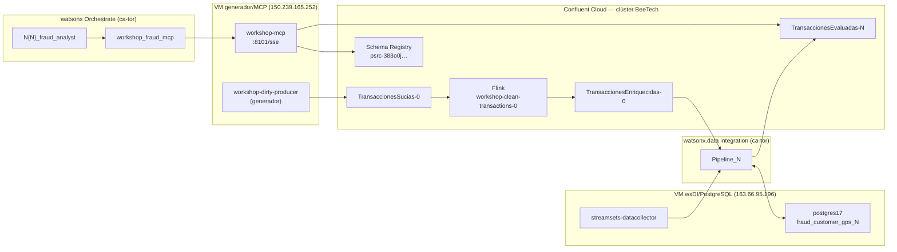

# Infraestructura del workshop — Detección de fraude

Resumen operativo de **dónde corre cada componente**, cómo se conectan y qué prepara IBM vs. qué construye cada participante.

Documentos relacionados:

- `workshop/FACILITATOR-RUNBOOK.md` — tareas del facilitador (arranque, monitoreo, cierre)
- `workshop/README.md` — flujo de datos de referencia (N=0)
- `orchestrate/fraud-workshop/README.md` — MCP, toolkit y paquetes Orchestrate
- `orchestrate/fraud-workshop/workshop_config.py` — URLs fijas del workshop

---

## Vista general



**Flujo en una frase:** la VM publica transacciones “sucias” → Flink las limpia → cada participante procesa en StreamSets → el MCP lee el tópico de salida → el agente en Orchestrate consulta vía toolkit compartido.

---

## 1. Máquinas virtuales

El workshop usa **dos VMs** con roles distintos.

### 1a. VM generador + MCP (`150.239.165.252`)

| Parámetro | Valor |
|-----------|-------|
| **IP pública** | `150.239.165.252` |
| **Usuario Linux** | `vpcuser` |
| **Ruta del repo en la VM** | `/home/vpcuser/workshop` |
| **Archivo de entorno** | `/home/vpcuser/workshop/.env` (credenciales Confluent; no está en git) |
| **Acceso SSH** | Credenciales enviadas por IBM (no documentadas en el repositorio) |

| Contenedor | Rol | Puerto / endpoint |
|------------|-----|-------------------|
| `workshop-dirty-producer` | Generador de transacciones sucias | Sin puerto expuesto (solo publica a Kafka) |
| `workshop-mcp` | Servidor MCP para Orchestrate | `http://150.239.165.252/workshop-mcp/sse` (nginx :80; Orchestrate no acepta el cert self-signed de :443) |

> **Nota de red:** Orchestrate (IBM Cloud) debe poder alcanzar el endpoint SSE del MCP. El puerto `8101` está cerrado desde fuera; nginx expone el MCP en `http://150.239.165.252/workshop-mcp/sse` (HTTP :80). También hay que proxear `/messages/` en la raíz — el protocolo SSE de MCP hace POST ahí, no bajo `/workshop-mcp/`.

### 1b. VM StreamSets + PostgreSQL (`163.66.95.196`)

| Parámetro | Valor |
|-----------|-------|
| **Hostname** | `wxdintg-stream-collector-vsi` |
| **IP pública** | `163.66.95.196` |
| **Acceso SSH** | `ssh -i cflt-vsi-key.pem root@163.66.95.196` |
| **OS** | RHEL 9 |

| Contenedor | Imagen | Rol |
|------------|--------|-----|
| `streamsets-datacollector` | `icr.io/streamsets/datacollector:JDK17_7.6.1` | **Engine wxDI** — ejecuta `Pipeline_0` y `Pipeline_N` |
| `postgres17` | `postgres:17-alpine` | **PostgreSQL JDBC** — tablas `fraud_customer_gps_0…30` |
| `minikube` | `gcr.io/k8s-minikube/kicbase` | Stack Confluent local para **enablement/demo** (no es BeeTech) |

**StreamSets → wxDI:**

| Parámetro | Valor |
|-----------|-------|
| API base | `https://api.ca-tor.dai.cloud.ibm.com` |
| Project ID | `e83564d3-80e2-45a8-abd9-9e05ea05ee87` |
| Environment ID | `019faa3b-7b0a-76b2-b697-c13ce1397634` |

El Data Collector no expone puertos al exterior; se conecta por túnel a wxDI (heartbeat activo).

**PostgreSQL:**

| Parámetro | Valor |
|-----------|-------|
| Puerto | `127.0.0.1:5432` (solo local en la VM) |
| Base de datos | `appdb` |
| Tablas | `fraud_customer_gps_0` … `fraud_customer_gps_30` |
| Credenciales | `/opt/postgres/secrets/` en la VM |

**Nginx en esta VM** (HTTPS → Minikube, stack Confluent de demo):

| Ruta | Servicio |
|------|----------|
| `https://163.66.95.196/` | Control Center |
| `https://163.66.95.196/sr/` | Schema Registry |
| `https://163.66.95.196/ksqldb/` | ksqlDB REST |
| `https://163.66.95.196/connect/` | Kafka Connect |
| `https://163.66.95.196/cmf/` | Confluent Manager for Flink (Basic Auth) |
| `:9094–9096` | Brokers Kafka (nodeports) |

> Este Minikube **no** es el Kafka del workshop de fraude. Los pipelines wxDI consumen/producen en **Confluent Cloud BeeTech**.

---

## 2. Generador de transacciones

| Parámetro | Valor |
|-----------|-------|
| **Dónde corre** | VM `150.239.165.252`, contenedor `workshop-dirty-producer` |
| **Código** | `workshop/generator/dirty_transaction_producer.py` |
| **Compose** | `workshop/generator/docker-compose.dirty-producer.yml` |
| **Estado por defecto** | **Detenido** — el facilitador lo inicia tras validar Flink y el engine de StreamSets |
| **Tópico destino** | `TransaccionesSucias-0` |
| **Subject Avro** | `TransaccionesSucias-0-value` |
| **Intervalo** | 1 evento cada 2 s (`PRODUCER_INTERVAL_SECONDS=2`) |
| **Mezcla** | ~80 % NORMAL · ~15 % SOSPECHOSA · ~5 % FRAUDULENTA |
| **Campo `source_system`** | `workshop-dirty-generator` |

### Arranque (facilitador)

```bash
cd /home/vpcuser/workshop/workshop/generator   # o la ruta real del repo en la VM
docker compose -f docker-compose.dirty-producer.yml up -d
docker logs --tail 50 workshop-dirty-producer
```

### Variables de entorno (en `.env` de la VM)

- `CONFLUENT_BOOTSTRAP_SERVERS` / `WORKSHOP_CONFLUENT_BOOTSTRAP_SERVERS`
- `CONFLUENT_CLUSTER_API_KEY` / `WORKSHOP_CONFLUENT_CLUSTER_API_KEY`
- `CONFLUENT_CLUSTER_API_SECRET`
- `CONFLUENT_SCHEMA_REGISTRY_URL`
- `CONFLUENT_SCHEMA_REGISTRY_API_KEY` + secret

---

## 3. Confluent Cloud

| Parámetro | Valor |
|-----------|-------|
| **Clúster** | `BeeTech` (también escrito `Beetech` en algunos docs) |
| **Tipo** | Standard |
| **Región Kafka** | AWS `us-east-1` |
| **Bootstrap servers** | Por email — asunto *"Bootcamp Beetech — Credenciales Confluent"* (no en el repo) |
| **Schema Registry URL** | `https://psrc-383o0j.southamerica-west1.gcp.confluent.cloud` |
| **Región SR** | GCP `southamerica-west1` |
| **Autenticación Kafka** | `SASL_SSL` + `PLAIN` (API key + secret por participante) |
| **Autenticación SR** | Basic Auth (`SR_KEY:SR_SECRET`) — va en `credenciales.txt` del paquete ZIP |

### Tópicos

| Tópico | Ámbito | Función |
|--------|--------|---------|
| `TransaccionesSucias-0` | Compartido (IBM) | Entrada del generador — datos con defectos intencionales |
| `TransaccionesEnriquecidas-0` | Compartido (IBM) | Salida de Flink — stream limpio para los pipelines |
| `TransaccionesEvaluadas-0` … `TransaccionesEvaluadas-30` | Por participante (IBM precarga 0–30) | Salida del pipeline: scoring + PII masking en Avro |

### Subjects de Schema Registry

| Subject | Uso |
|---------|-----|
| `TransaccionesSucias-0-value` | Contrato `DirtyTransactionValue` (entrada) |
| `TransaccionesEnriquecidas-0-value` | Registro enriquecido post-Flink |
| `TransaccionesEvaluadas-N-value` | Salida de cada `Pipeline_N` |

### ACLs por participante (API key individual)

- **READ** `TransaccionesEnriquecidas-0`
- **WRITE** `TransaccionesEvaluadas-N` (su número)
- **READ** consumer group `fraud-workshop-N`

---

## 4. Apache Flink (Confluent Cloud)

| Parámetro | Valor |
|-----------|-------|
| **Dónde corre** | Confluent Cloud Flink (managed), no en la VM |
| **Statement** | `workshop-clean-transactions-0` |
| **Estado requerido** | `RUNNING` |
| **Entrada** | `TransaccionesSucias-0` |
| **Salida** | `TransaccionesEnriquecidas-0` |
| **SQL** | `workshop/flink/clean-dirty-transactions-n0.sql` |
| **Esquema entrada** | `workshop/flink/dirty-transaction-value.avsc` |

Flink normaliza campos inconsistentes (TRIM, CAST, REGEXP_REPLACE, etc.) antes de que StreamSets consuma el stream.

---

## 5. watsonx.data integration + StreamSets Data Collector

| Parámetro | Valor |
|-----------|-------|
| **Plataforma** | IBM watsonx.data integration (wxDI) |
| **Motor de streaming** | StreamSets (canvas visual) |
| **Engine de ejecución** | StreamSets Data Collector en VM `163.66.95.196` (contenedor `streamsets-datacollector`) |
| **Proyecto wxDI** | Pre-creado por IBM — Project ID `e83564d3-80e2-45a8-abd9-9e05ea05ee87` |

### Conexiones pre-creadas en wxDI (no recrear)

| Conexión | Uso |
|----------|-----|
| **Confluent Cloud** | Kafka Consumer + Kafka Producer (bootstrap + SR) |
| **PostgreSQL** | JDBC Lookup + JDBC Producer |

### Pipelines

| Pipeline | Consumer group | Entrada Kafka | Salida Kafka |
|----------|----------------|---------------|--------------|
| `Pipeline_0` (referencia IBM) | `fraud-demo-0` | `TransaccionesEnriquecidas-0` | `TransaccionesEvaluadas-0` |
| `Pipeline_N` (participante) | `fraud-workshop-N` | `TransaccionesEnriquecidas-0` | `TransaccionesEvaluadas-N` |

### Stages del pipeline (orden)

1. **Kafka Consumer** — lee `TransaccionesEnriquecidas-0` (Avro + Schema Registry)
2. **JDBC Lookup** — consulta última posición del cliente en PostgreSQL
3. **JavaScript Evaluator** — scoring de fraude (`workshop/streamsets/fraud-evaluator.js`)
4. **Field Masker** — enmascara PII (nombre, email, tarjeta)
5. **Kafka Producer** — publica en `TransaccionesEvaluadas-N`
6. *(rama secundaria)* **JDBC Producer** — `UPDATE` en `fraud_customer_gps_N`

---

## 6. PostgreSQL

| Parámetro | Valor |
|-----------|-------|
| **Motor** | PostgreSQL 17 |
| **Ubicación** | VM `163.66.95.196`, contenedor `postgres17` |
| **Conexión en wxDI** | `PostgreSQL` (pre-creada) |
| **Base de datos** | `appdb` |
| **Esquema** | `public` |
| **Tablas** | `fraud_customer_gps_0` … `fraud_customer_gps_30` (precargadas por IBM) |
| **Host / puerto JDBC** | IP interna de la VM, puerto `5432` (solo accesible desde la VM; wxDI usa la conexión preconfigurada) |

Cada tabla guarda el último estado geográfico y score del cliente para el lookup de velocidad imposible y el `UPDATE` tras cada transacción.

---

## 7. MCP del workshop

| Parámetro | Valor |
|-----------|-------|
| **Dónde corre** | VM `150.239.165.252`, contenedor `workshop-mcp` |
| **Endpoint** | `http://150.239.165.252/workshop-mcp/sse` (proxy nginx en :80) |
| **Transporte** | SSE |
| **Código** | `orchestrate/fraud-workshop/tools/workshop_mcp_server.py` |
| **Dependencias** | `orchestrate/fraud-workshop/tools/requirements.txt` (`fastmcp`, `confluent-kafka`, `fastavro`, `requests`) |
| **Credenciales** | Variables de entorno Confluent **dentro del contenedor** (misma cuenta/cluster del workshop) |

### Tools expuestas

| Tool | Parámetro clave | Lee de |
|------|-----------------|--------|
| `get_fraud_summary` | `topic_number` (0–30) | `TransaccionesEvaluadas-{N}` |
| `get_suspicious_transactions` | `topic_number` | idem |
| `get_transaction_detail` | `topic_number`, `transaction_id` | idem |
| `get_customer_activity` | `topic_number`, `customer_id` | idem |

El MCP crea consumer groups efímeros: `mcp-workshop-{topic_number}-{timestamp}-{counter}`.

### Modelo Orchestrate (uno para todos)

```
workshop-mcp :8101/sse
       ↑
workshop_fraud_mcp   ← toolkit remoto (IBM registra una vez)
       ↑
N3_fraud_analyst     ← cada participante importa solo su agente
```

Registro del toolkit (facilitador, una vez):

```bash
cd orchestrate/fraud-workshop
orchestrate env activate workshop --api-key <ORCHESTRATE_API_KEY>
./register_shared_toolkit.sh
```

---

## 8. watsonx Orchestrate

| Parámetro | Valor |
|-----------|-------|
| **Provisioning** | IBM TechZone |
| **Región** | Canada Toronto (`ca-tor`) |
| **URL de API** | `https://api.ca-tor.watson-orchestrate.cloud.ibm.com/instances/c3385561-1fc9-40d5-a072-01acb6137494` |
| **CLI env** | `workshop` |
| **Toolkit compartido** | `workshop_fraud_mcp` |
| **Agente referencia** | `N0_fraud_analyst` |
| **Agentes participantes** | `N1_fraud_analyst` … `N30_fraud_analyst` |
| **LLM (spec actual)** | `groq/openai/gpt-oss-120b` |

### Paquete por participante (`fraud-workshop-N.zip`)

Generado con `python orchestrate/fraud-workshop/build_participant_packages.py` y publicado en `docs/assets/downloads/fraud-workshop/` para descarga desde el sitio del lab.

Contenido:

| Archivo | Contenido |
|---------|-----------|
| `agent-spec-N.yaml` | Definición del agente con `topic_number="N"` fijo |
| `credenciales.txt` | `Orchestrate API Key` + `Schema Registry Basic Auth` |
| `README.md` | Pasos de importación con la CLI |

El toolkit **no** va en el ZIP — ya está registrado en Orchestrate.

---

## 9. Matriz de recursos por participante

Para **N = 1…30** (N=0 es referencia IBM):

| Recurso | Patrón |
|---------|--------|
| Pipeline wxDI | `Pipeline_N` |
| Consumer group Kafka | `fraud-workshop-N` |
| Tópico entrada (compartido) | `TransaccionesEnriquecidas-0` |
| Tópico salida | `TransaccionesEvaluadas-N` |
| Subject SR salida | `TransaccionesEvaluadas-N-value` |
| Tabla PostgreSQL | `fraud_customer_gps_N` |
| Agente Orchestrate | `N{N}_fraud_analyst` |
| ZIP | `fraud-workshop-N.zip` |

---

## 10. Credenciales — quién entrega qué

| Credencial | Dónde la usa el participante | Cómo llega |
|------------|------------------------------|------------|
| Confluent API key + secret (Kafka) | wxDI / pipelines | Email *Bootcamp Beetech* |
| Schema Registry Basic Auth | Stages Kafka en wxDI | `credenciales.txt` del ZIP |
| Orchestrate API Key | CLI `orchestrate env activate` | `credenciales.txt` del ZIP |
| Acceso wxDI | Canvas de pipelines | Invitación IBM al proyecto |
| Acceso Confluent Cloud | UI del clúster BeeTech | Cuenta del bootcamp |
| Acceso Orchestrate UI | Chat con el agente | TechZone |

**No commitear:** `orchestrate/fraud-workshop/credentials.master.txt` ni los ZIPs generados con claves reales (`docs/assets/downloads/fraud-workshop/*.zip` están en `.gitignore`).

---

## 11. Responsabilidades IBM vs. participante

| Componente | IBM | Participante |
|------------|-----|--------------|
| VM, generador, MCP | Instala y opera | — |
| Clúster Confluent, tópicos 0–30, Flink | Prepara y monitorea | Observa en Confluent |
| Engine StreamSets + conexiones wxDI | Despliega y mantiene online | Usa conexiones existentes |
| `Pipeline_0`, tablas JDBC, toolkit MCP | Referencia | — |
| `Pipeline_N`, agente `N{N}_fraud_analyst` | Genera ZIP | Construye pipeline e importa agente |

---

## 12. Checklist rápido pre-workshop (facilitador)

1. Flink `workshop-clean-transactions-0` en `RUNNING`
2. Offsets de `TransaccionesSucias-0` y `TransaccionesEnriquecidas-0` avanzando (tras arrancar generador)
3. Engine StreamSets **online** en wxDI
4. `Pipeline_0` validado; tablas `fraud_customer_gps_0…30` con datos
5. Contenedor `workshop-mcp` activo; endpoint SSE alcanzable desde Orchestrate
6. Toolkit `workshop_fraud_mcp` registrado
7. ZIPs 1–30 generados y publicados en el sitio de documentación
8. `N0_fraud_analyst` probado contra `TransaccionesEvaluadas-0`

---

## 13. Valores no documentados en el repositorio

Estos datos existen en producción pero **no están hardcodeados en git** — el facilitador los tiene por email, TechZone o la consola wxDI:

- Bootstrap servers Kafka (`pkc-…`) — Confluent Cloud BeeTech
- Credenciales JDBC de PostgreSQL — en `/opt/postgres/secrets/` de la VM `163.66.95.196`
- URL de la consola wxDI (el engine se registra vía `api.ca-tor.dai.cloud.ibm.com`)
- Hostname DNS de la VM generador (`150.239.165.252` — solo IP documentada)
- Dockerfile/compose del contenedor `workshop-mcp` (solo nombre y puerto documentados)

Actualizar este documento cuando esos valores queden estabilizados en un entorno concreto.
